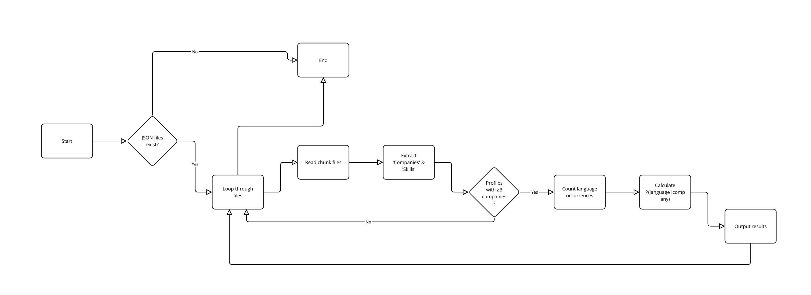
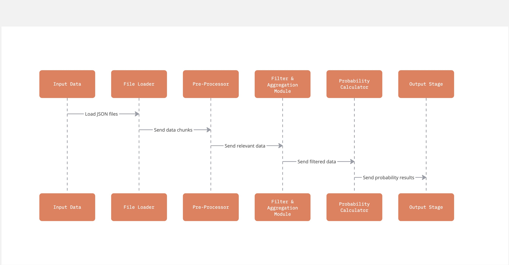

# 📊 dev-profile-analyzer

A high-performance Python program that processes JSON profiles, extracts company and skill data, and computes conditional probabilities.

## 🚀 Features

- ✅ **Processes JSON profiles** in bulk using multiprocessing
- ✅ **Extracts unique companies and skills** from JSON files
- ✅ **Counts occurrences** of companies and skills
- ✅ **Filters profiles that have fewer than 3 companies** (only profiles with **3+ companies** are considered)
- ✅ **Computes conditional probabilities** `P(Skill | Company)`
- ✅ **Uses orjson for fast JSON parsing**
- ✅ **Utilizes defaultdict for optimized dictionary operations**
- ✅ **Parallel processing with workers (multiprocessing)** to speed up batch processing

---

## 📂 Project Structure
```pgsql
├── README.md
├── __pycache__
├── data_processing.py
├── file_utils.py
├── main.py
├── profiles
└── requirements.txt
```

---

## ⚡ Installation

1. **Clone the repository**
```sh
   git clone https://github.com/your-username/dev-profile-analyzer.git
   cd dev-profile-analyzer
```

2. **Create a virtual environment**
```sh
    python -m venv venv
    source venv/bin/activate  # On macOS/Linux
    venv\Scripts\activate     # On Windows
```

3. **Install dependencies**
```sh
    pip install -r requirements.txt
```

4. **Profiles folder**
```sh
    https://drive.google.com/file/d/1En6JSPE0o3vMxf6l9W8fn4RQAwIbSZx7/view
```

## 📜 Usage
**To run the program, execute:**
```sh
    python src/main.py
```

## **This will:**
    - Load all JSON profiles from the profiles/ directory.
    - Process them in parallel using multiprocessing workers.
    - Filter out profiles that have fewer than 3 companies.
    - Compute conditional probabilities P(Skill | Company).
    - Print the results in the following format:
```less
    P(Go | Amazon): 0.4722445695897024
    P(Rust | Amazon): 0.4648028962188254
```

## 🛠 Workflow Diagram




## 🏗️ High-Level Design



## 🔍 How It Works
    1️⃣ Read JSON Files
        * Uses orjson.loads() for fast and efficient JSON parsing.

    2️⃣ Extract Companies and Skills
        * Extracts unique values from companies and skills fields.
    
    3️⃣ Filter Profiles with Less Than 3 Companies
        * Profiles with fewer than 3 companies are skipped to ensure meaningful probability calculations.

    4️⃣ Count Occurrences
        * Uses defaultdict(int) to efficiently count occurrences.

    5️⃣ Compute Conditional Probabilities
        * Uses joint probability and Bayes' theorem to calculate P(Skill | Company).

    6️⃣ Parallel Processing with Workers
        * The program uses multiprocessing workers to speed up batch processing.
        * Number of workers is set in NUM_WORKERS = 4 (configurable).
        * Each worker processes a batch of JSON files in parallel, reducing execution time.


## 📌 Example JSON Profile
```json
    {
        "name": "John Doe",
        "companies": ["Amazon"],
        "skills": ["Go", "Rust"]
    }
```

## 🛠 Dependencies
    - Python 3.8+
    - orjson (Fast JSON processing)
    - multiprocessing (Efficient batch processing)

## Install dependencies via:
```sh
    pip install -r requirements.txt
```

## 🔴 Core Bottlenecks (Why Are These Challenges?)
    1️⃣ Memory Bottleneck – Large Dataset (10,000 Files)
        ❓ Why is this a problem?
            💡 Because loading everything at once could cause memory overflow and slow down execution.
        ❓ Why do we need a better approach?
            💡 Because an inefficient method would waste computation time and make debugging difficult.
    ✅ Solution: Use an efficient file loading strategy (Streaming/Batches/Parallel Execution).

    2️⃣ I/O Bottleneck – File Processing Speed
        ❓ Why is this a problem?
            💡 Reading 10,000 individual files one-by-one can be very slow.
        ❓ Why do we need a faster approach?
            💡 Because the bigger the dataset, the longer it takes to extract meaningful insights.
    ✅ Solution: Batch processing or parallel execution could improve speed.


